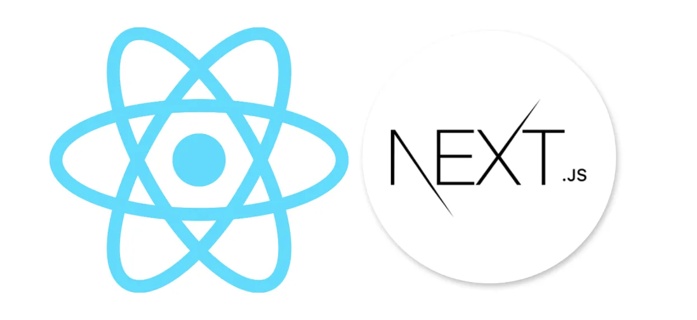

<h1 align="center">
   NEXT SEGUNDO
</h1>

<p align="center">
   

  

  

  <br>
  
  <a href="https://www.codacy.com/manual/Gabriel4420/CalculadoraIMC?utm_source=github.com&amp;utm_medium=referral&amp;utm_content=Gabriel4420/CalculadoraIMC&amp;utm_campaign=Badge_Grade">
    
  </a>
  
  

  <a href="https://www.linkedin.com/in/gabriel-rodrigues-perez-2069b072/">
    
  </a>
</p>

---

<p align="center">
  
</p>

---

# Indice

- :rocket: [Sobre o Projeto](#rocket-sobre-o-projeto)
- 👨‍💻️ [Tecnogias utilizadas](#%EF%B8%8F-tecnogias-utilizadas)
- 📦️ [Como utilizar o projeto](#%EF%B8%8F-como-utilizar-o-projeto)

---

## :rocket: Sobre o Projeto

<p> O repositório "next-segundo" no GitHub foi criado com o objetivo de consolidar diversos conceitos do Next.js 12 utilizando TypeScript. Ele é um recurso abrangente para desenvolvedores que desejam aprimorar suas habilidades e conhecimento em desenvolvimento web moderno. O repositório cobre tópicos essenciais como renderização no lado do servidor (Server Side Rendering), renderização no lado do cliente (Client Side Rendering), e geração de caminhos estáticos (Static Paths). Cada conceito é exemplificado através de implementações práticas e bem documentadas, facilitando o entendimento e a aplicação em projetos reais.</p>

<p>Além dos conceitos mencionados, o "next-segundo" também explora o uso do hook useRouter, proporcionando uma compreensão aprofundada sobre navegação e roteamento em aplicações Next.js. O repositório está estruturado de maneira clara e organizada, com exemplos de código comentados e instruções detalhadas. Isso torna mais fácil para desenvolvedores de todos os níveis acompanharem e aprenderem. Seja você um iniciante em Next.js ou um desenvolvedor experiente buscando reforçar seus conhecimentos, "next-segundo" é um recurso valioso para aprimorar suas habilidades em desenvolvimento web com Next.js e TypeScript</p>
---

## 👨‍💻️ Tecnogias utilizadas

O projeto foi desenvolvido utilizando as seguintes tecnologias:

- [next](https://nextjs.org/)

### Dependências

- [typescript](https://www.typescriptlang.org/)

### Padronização de código

- [ESLint](https://eslint.org/)
- [Prettier](https://prettier.io/)
- :mouse: [Editor Config](https://editorconfig.org/)

### IDE

- [Visual Studio Code](https://code.visualstudio.com/)

---

## 📦️ Como utilizar o projeto

Para copiar o projeto, utilize os comandos:

```bash
  # Clonar o repositório
  ❯ git clone https://github.com/Gabriel4420/next-segundo.git

```

**Utilizando npm**

```bash
  # verificar as dependências e instala
  ❯ npm run install
  # Roda o projeto
  ❯ npm run dev
 
```


---

<h4 align="center">
  Feito com ❤️ por Gabriel Rodrigues 👋️ <a href="mailto:gabriel_rodrigues_perez@hotmail.com">Entre em contato!</a>
</h4>

<p align="center">

  <a href="https://www.linkedin.com/in/gabriel-rodrigues-perez-2069b072/">
    
  </a>
  <a href="https://www.facebook.com/gabriel.rodrigues.perez">
    
  </a>
  <a href="https://www.instagram.com/gabriel_rodrigues_perez/">
    
  </a>
  
</p>
